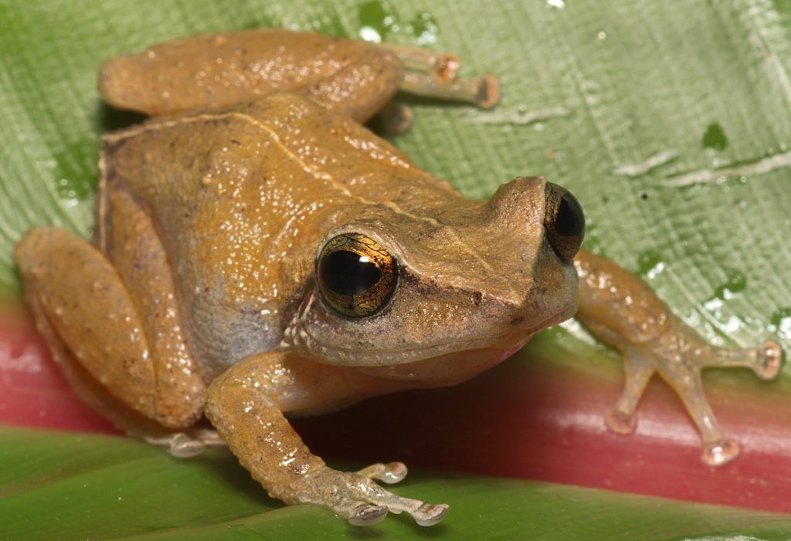
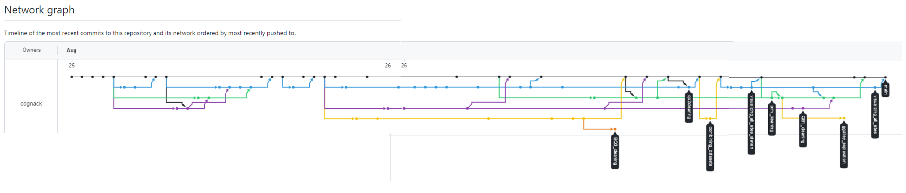
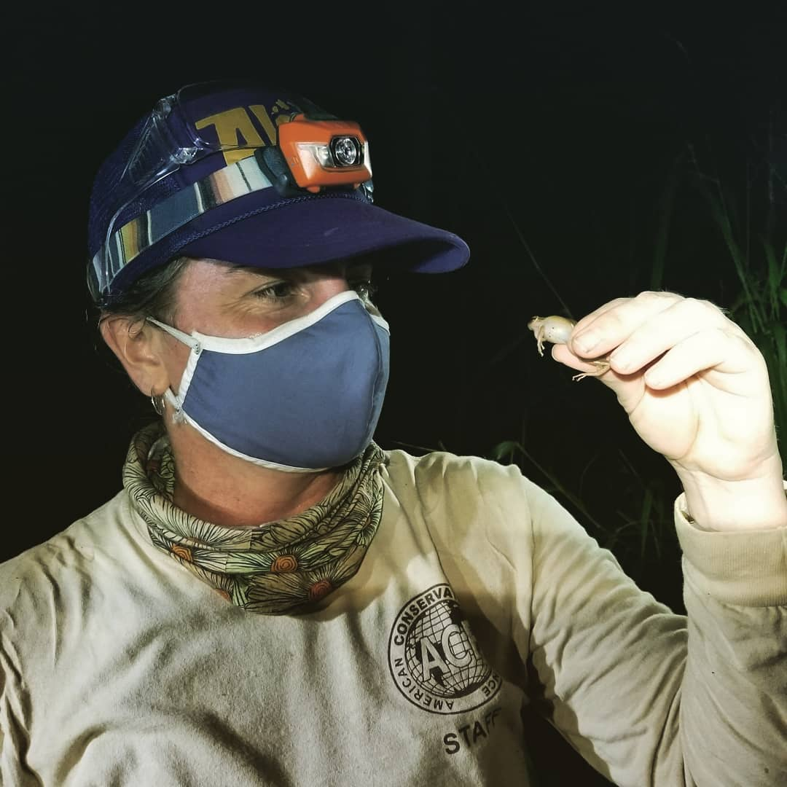

```{r setup, include=FALSE}
knitr::opts_chunk$set(echo = TRUE, warning = FALSE, message = FALSE)

library(tidyverse)
library(janitor)
library(lubridate)
library(patchwork)
library(here)
```



### Questions 
*technical:* How did hurricane Hugo impact stream chemistry at the Luquillo Experimental Forest?

*team work flow:* How can we collaborate to clean data, combine data, and produce a visualization? 

### Set Up

- Steven made a Github repo with an R project containing our data
- Marie, Julia, and Scout were assigned as collaborators on the repo
- All of us worked on the project through our user accounts in the Taylor server
- The data was stored in the Github repo and was uploaded in one person's project. 
- Finally, we updated the way we call our data in from calling from our data folder in the project to calling from our shared storage group folder in the class folder on the Taylor Server.
  
### Team Organization 

- First worked in assigned code chunks in the Rmd in one main branch. 
- After a few conflicts, we tried working in separate branches. We did:
  - Data cleaning on out own computers while verbalizing discussing our process
  - Practice visualizations of individual sites on our own computers/branches to plan for all-sites graph
    - We merged these branches to the main branch 
  - We created a new branch from main for the next processes
    - Pair-coded with designated drivers and navigators for combining dataframes and creating visualization in branches 
    - Navigators looked up visualization techniques and components and discussed dicisions with the rest of group 



#### Code below reads in and assigns multiple CSV files
```{r}
# create a list of file names to read in

`QuebradaCuenca1-Bisley` <- read_csv("/courses/EDS214/coqui_crew/data/QuebradaCuenca1-Bisley.csv", na = c("-9999","-9999.0","-9999.00"))

`QuebradaCuenca2-Bisley` <- read_csv("/courses/EDS214/coqui_crew/data/QuebradaCuenca2-Bisley.csv", na = c("-9999","-9999.0","-9999.00"))

`QuebradaCuenca3-Bisley` <- read_csv("/courses/EDS214/coqui_crew/data/QuebradaCuenca3-Bisley.csv", na = c("-9999","-9999.0","-9999.00"))

`RioMameyesPuenteRoto` <- read_csv("/courses/EDS214/coqui_crew/data/RioMameyesPuenteRoto.csv", na = c("-9999","-9999.0","-9999.00"))
```


#### Cleaning BQ1 : Julia
```{r}
bq1 <- `QuebradaCuenca1-Bisley` %>% 
  clean_names() %>% 
  mutate(sample_date = lubridate::mdy(sample_date)) %>% 
  mutate(year = year(sample_date)) %>% 
  mutate(month = month(sample_date)) %>% 
  select(-sample_time)
```


#### Cleaning BQ2: Scout
```{r}
#created a new df called "bq2"
#separated the sample date column into sample dates and sample times for ease of wrangling the dates, which are of more importance 
#used lubridate to change `sample_date` data to mdy format
#added a year column using sample_date
#added a month column using sample_date

bq2 <- `QuebradaCuenca2-Bisley` %>% 
  clean_names() %>% 
  separate(col = sample_date, into = c("sample_date", "sample_time"), sep = " ") %>% 
  mutate(sample_date = lubridate::mdy(sample_date)) %>% 
  mutate(year = year(sample_date)) %>% 
  mutate(month = month(sample_date)) %>% 
  select(-sample_time)

```


#### Cleaning BQ3: Marie
```{r}
# cleaning data for BQ3
bq3 <- `QuebradaCuenca3-Bisley` %>% 
  clean_names() %>% 
  mutate(sample_date = lubridate::mdy(sample_date)) %>% 
  mutate(year = year(sample_date)) %>% 
  mutate(month = month(sample_date)) %>% 
  select(-sample_time)
```

#### Cleaning PRM: Steven
```{r}
prm <- RioMameyesPuenteRoto %>% 
  
  # clean name headings
  clean_names() %>% 
  
  # changed date "character" to "datetime"
  mutate(sample_date = lubridate::mdy(sample_date)) %>% 
  
  # separate out month and year
  mutate(year = year(sample_date)) %>% 
  mutate(month = month(sample_date)) %>% 
  select(-sample_time)
  
```
#### Combining Datasets: Marie
```{r}
all_sites <- bind_rows(prm, bq1, bq2, bq3) %>% 
  group_by(sample_id)
```

#### Visualizing All Sites: Scout

```{r}
all_sites_k <- ggplot(data = all_sites, aes(x = sample_date, y = k)) +
  geom_line(aes(color = sample_id, linetype = sample_id),
            size = 0.25,
            show.legend = FALSE) +
  scale_color_manual(values = c("blue4", "cyan2", "goldenrod1", "firebrick1")) +
  geom_vline(xintercept = as.numeric(as.Date("1989-09-21")), color = "blue", size = 1) +
  labs(title = "Impact of Hurricane Hugo on Stream Chemistry",
       subtitle = "Difference in Potassium and Nitrate at Stream Sites in the Luquillo Experimental Forest",
       x = NULL,
       y = expression(paste("k mg ", l^{-1}))) +
  scale_x_date(position = "top") +
  theme_minimal()

#all_sites_k 
#(used to view separate graphs before combining)

all_sites_no3 <- ggplot(data = all_sites, aes(x = sample_date, y = no3)) +
  geom_line(aes(color = sample_id, linetype = sample_id),
            size = 0.25,
            show.legend = TRUE) +
  scale_color_manual(values = c("blue4", "cyan2", "goldenrod1", "firebrick1")) +
  geom_vline(xintercept = as.numeric(as.Date("1989-09-21")), color = "blue", size = 1) +
  labs(x = NULL,
       y = expression(paste(NO[3]," ", "-N ", ug, l^{-1})),
       caption = "McDowell, W. 2021. Chemistry of stream water from the Luquillo Mountains ver 4923052. Environmental Data Initiative.") +
  theme_minimal() +
  theme(axis.text.x = element_blank())
  

#all_sites_no3 
#(used to view separate graphs before combining)

```


```{r}
(all_sites_k / all_sites_no3) &
  theme(legend.position = c(0.9, 0.6),
        legend.background = element_blank(),
        legend.key.size = unit(0.1, 'cm'), 
        legend.title = element_blank())
```

### Results / Challenges

We focused mostly on the team component over the analysis component in completing this project. Particularly, we learned a lot about branching in team work flows. 

While we had some conflicts as we worked in the same branch, they were small! We realized they were pretty easy to resolve and less scary retrospectively than the work of thinking about our branch structures! 

In this process, we learned that creating separate markdown files may have been more efficient than multiple branches. For each branch merge to the main, we spent quite a bit of time thinking about the implications of merging. The conceptual logistics slowed down our analysis overall. It would have been complicated to work in the branches like this if we were not all in the same room! 

Another lesson we learned is that it's not advisable to experiment with code in the main branch. You always want to know that your main branch will run without error. A good use of branching is to experiment with new code in a single branch that can then be merged into the main branch without conflict when you're happy with the code. We only worked in the main branch to do things like add this text!

